# Airbnb Data Engineering Project

A production-grade data pipeline built with **dbt (Data Build Tool)** and **Snowflake**, implementing the **Medallion Architecture** (Bronze → Silver → Gold) to transform raw Airbnb CSV data from AWS S3 into analytics-ready dimension and fact tables with SCD Type 2 history tracking.

---

## Architecture Overview

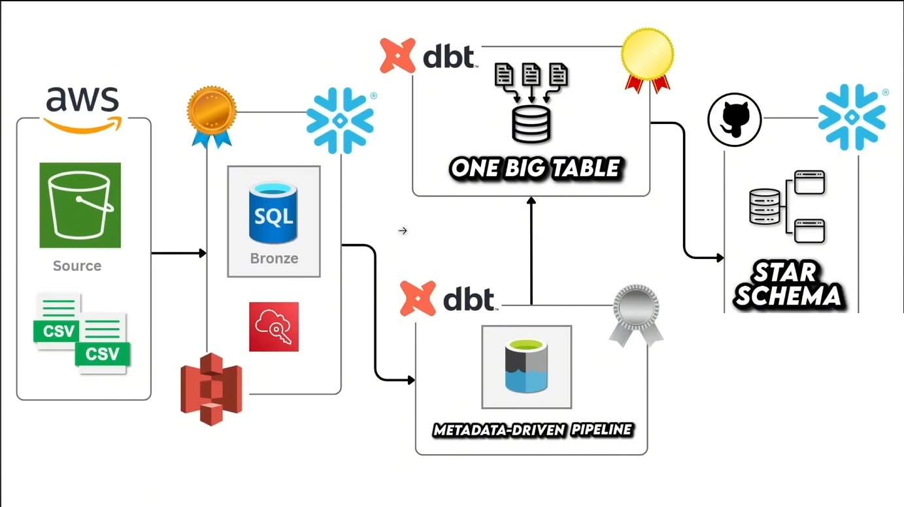

The pipeline follows a layered medallion architecture:

| Layer | Purpose | Materialization |
|---|---|---|
| **Staging** | Raw CSV data loaded from AWS S3 into Snowflake | Snowflake Tables (external load) |
| **Bronze** | Direct copy from staging with incremental CDC | Incremental |
| **Silver** | Cleaned, transformed, and enriched data | Incremental + Upsert |
| **Gold** | Business-ready fact table, OBT, and dimension snapshots | Table + Ephemeral + SCD2 |

---

## Tech Stack

- **dbt Core** — transformation framework
- **Snowflake** — cloud data warehouse
- **AWS S3** — source data lake (CSV files)
- **Python + uv** — project environment management

---

## Project Structure

```
DE-AIRBNB-PROJECT/
├── AIRBNB_PROJECT/
│   ├── models/
│   │   ├── sources/         # Source definitions (sources.yml)
│   │   ├── bronze/          # Raw ingestion from staging
│   │   ├── silver/          # Cleaned and enriched models
│   │   └── gold/
│   │       ├── fact.sql     # Main fact table
│   │       ├── obt.sql      # One Big Table
│   │       └── ephemeral/   # Intermediate dimension models
│   ├── macros/              # Custom Jinja macros
│   ├── snapshots/           # SCD Type 2 dimension snapshots
│   ├── tests/               # Custom data quality tests
│   ├── analyses/            # Ad-hoc SQL analyses
│   └── dbt_project.yml
├── snowflake_sql/           # DDL and staging load scripts
└── images/                  # Architecture and table screenshots
```

---

## Data Source — AWS S3 Data Lake

Raw CSV files are stored in an AWS S3 bucket and loaded into Snowflake's staging schema.

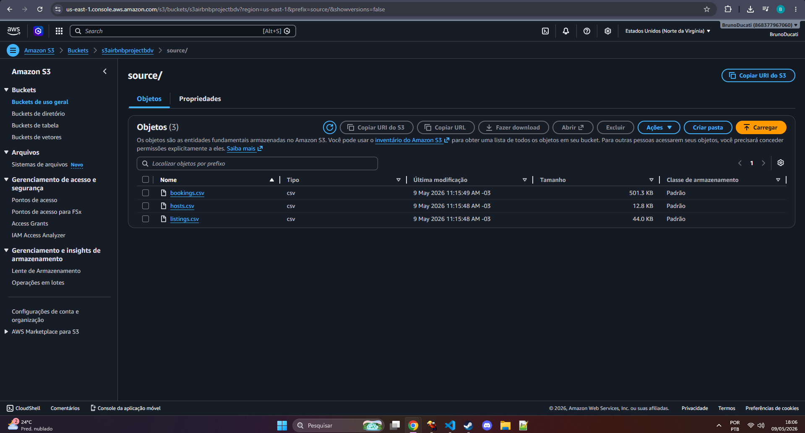

### Snowflake Staging Tables (DDL)

```sql
CREATE OR REPLACE TABLE HOSTS (
    host_id        NUMBER,
    host_name      STRING,
    host_since     DATE,
    is_superhost   BOOLEAN,
    response_rate  NUMBER,
    created_at     TIMESTAMP,
    PRIMARY KEY (host_id)
);

CREATE OR REPLACE TABLE LISTINGS (
    listing_id     NUMBER,
    host_id        NUMBER,
    property_type  STRING,
    room_type      STRING,
    city           STRING,
    country        STRING,
    accommodates   NUMBER,
    bedrooms       NUMBER,
    bathrooms      NUMBER,
    price_per_night NUMBER,
    created_at     TIMESTAMP,
    PRIMARY KEY (listing_id)
);

CREATE OR REPLACE TABLE BOOKINGS (
    booking_id     STRING,
    listing_id     NUMBER,
    booking_date   TIMESTAMP,
    nights_booked  NUMBER,
    booking_amount NUMBER,
    cleaning_fee   NUMBER,
    service_fee    NUMBER,
    booking_status STRING,
    created_at     TIMESTAMP,
    PRIMARY KEY (booking_id)
);
```

### S3 to Snowflake Load Script

```sql
CREATE FILE FORMAT IF NOT EXISTS csv_format
  TYPE = 'CSV'
  FIELD_DELIMITER = ','
  SKIP_HEADER = 1
  ERROR_ON_COLUMN_COUNT_MISMATCH = FALSE;

CREATE OR REPLACE STAGE snowstage
  FILE_FORMAT = csv_format
  URL = 's3://s3airbnbprojectbdv/source/';

COPY INTO LISTINGS FROM @snowstage FILES = ('listings.csv')
  CREDENTIALS = (aws_key_id = '<key>', aws_secret_key = '<secret>');

COPY INTO BOOKINGS FROM @snowstage FILES = ('bookings.csv')
  CREDENTIALS = (aws_key_id = '<key>', aws_secret_key = '<secret>');

COPY INTO HOSTS    FROM @snowstage FILES = ('hosts.csv')
  CREDENTIALS = (aws_key_id = '<key>', aws_secret_key = '<secret>');
```

#### Staging Tables in Snowflake

| Bookings | Hosts | Listings |
|---|---|---|
| 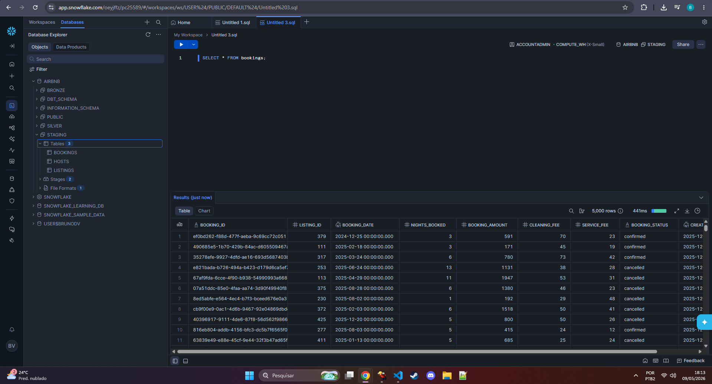 | 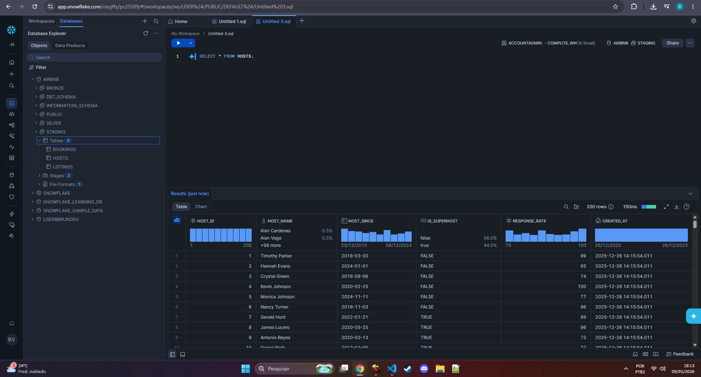 | 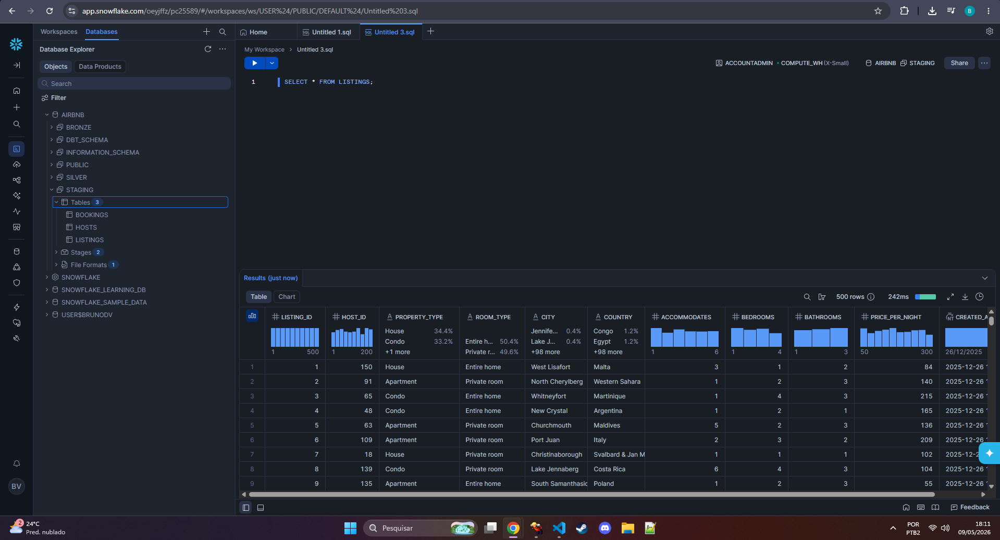 |

---

## Bronze Layer — Raw Incremental Ingestion

The bronze layer copies data directly from the staging schema with **incremental loading** based on the `CREATED_AT` timestamp. On the first run the full table is loaded; on subsequent runs only new rows are appended.

### Source Definitions (`sources.yml`)

```yaml
sources:
  - name: staging
    database: AIRBNB
    schema: staging
    tables:
      - name: listings
      - name: bookings
      - name: hosts
```

### `bronze_bookings.sql`

```sql
{{ config(materialized='incremental') }}

SELECT * FROM {{ source('staging', 'bookings') }}


    WHERE CREATED_AT > (SELECT COALESCE(MAX(CREATED_AT), '1900-01-01') FROM {{ this }})

```

### `bronze_listings.sql`

```sql
{{ config(materialized='incremental') }}

SELECT * FROM {{ source('staging', 'listings') }}


    WHERE CREATED_AT > (SELECT COALESCE(MAX(CREATED_AT), '1900-01-01') FROM {{ this }})

```

### `bronze_hosts.sql`

```sql
{{ config(materialized='incremental') }}

SELECT * FROM {{ source('staging', 'hosts') }}


    WHERE CREATED_AT > (SELECT COALESCE(MAX(CREATED_AT), '1900-01-01') FROM {{ this }})

```

#### Bronze Tables in Snowflake

| Bookings | Hosts | Listings |
|---|---|---|
| 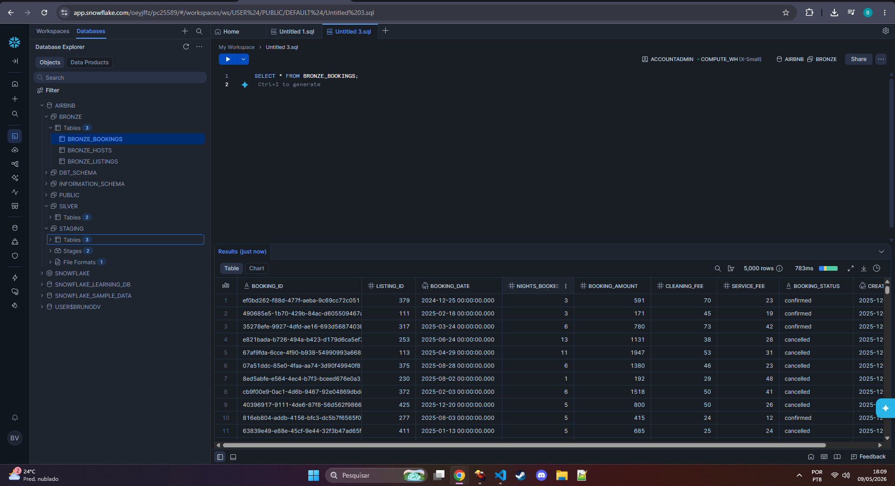 | 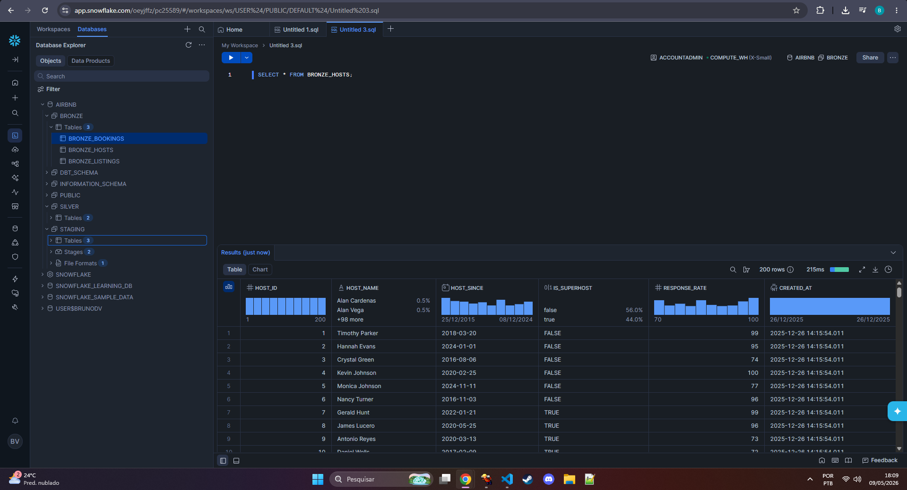 | 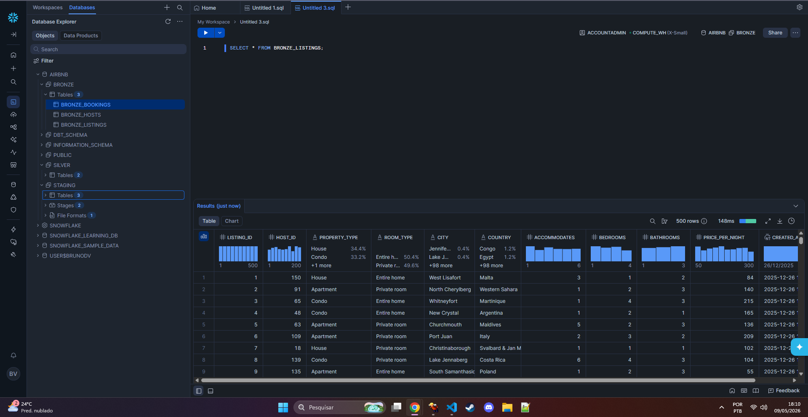 |

---

## Silver Layer — Transformation & Enrichment

The silver layer applies **business logic**, **data cleaning**, and **enrichment** on top of the bronze tables. All models use incremental materialization with `unique_key` for upsert semantics — new and updated records are merged, not duplicated.

### `silver_bookings.sql`

Calculates the total booking cost using the custom `multiply()` macro:
`TOTAL_BOOKING_AMOUNT = (NIGHTS_BOOKED × BOOKING_AMOUNT × 2) + CLEANING_FEE + SERVICE_FEE`

```sql
{{ config(materialized='incremental', unique_key='BOOKING_ID') }}

SELECT
    BOOKING_ID,
    LISTING_ID,
    BOOKING_DATE,
    {{ multiply('NIGHTS_BOOKED', 'BOOKING_AMOUNT', 2) }} + CLEANING_FEE + SERVICE_FEE AS TOTAL_BOOKING_AMOUNT,
    SERVICE_FEE,
    CLEANING_FEE,
    BOOKING_STATUS,
    CREATED_AT
FROM {{ ref('bronze_bookings') }}
```

### `silver_listings.sql`

Categorises `PRICE_PER_NIGHT` into `LOW / MEDIUM / HIGH` tiers using the custom `tag()` macro:

```sql
{{ config(materialized='incremental', unique_key='LISTING_ID') }}

SELECT
    LISTING_ID,
    HOST_ID,
    PROPERTY_TYPE,
    ROOM_TYPE,
    CITY,
    COUNTRY,
    ACCOMMODATES,
    BEDROOMS,
    BATHROOMS,
    PRICE_PER_NIGHT,
    {{ tag('CAST(PRICE_PER_NIGHT AS INT)') }} AS PRICE_PER_NIGHT_TAG,
    CREATED_AT
FROM {{ ref('bronze_listings') }}
```

### `silver_hosts.sql`

Cleans host names (replaces spaces with underscores) and classifies response rate quality:

```sql
{{ config(materialized='incremental', unique_key='HOST_ID') }}

SELECT
    HOST_ID,
    REPLACE(HOST_NAME, ' ', '_') AS HOST_NAME,
    HOST_SINCE,
    IS_SUPERHOST,
    RESPONSE_RATE,
    CASE
        WHEN RESPONSE_RATE > 95 THEN 'VERY GOOD'
        WHEN RESPONSE_RATE > 80 THEN 'GOOD'
        WHEN RESPONSE_RATE > 60 THEN 'FAIR'
        ELSE 'POOR'
    END AS RESPONSE_RATE_QUALITY,
    CREATED_AT
FROM {{ ref('bronze_hosts') }}
```

#### Silver Tables in Snowflake

| Bookings | Hosts | Listings |
|---|---|---|
| 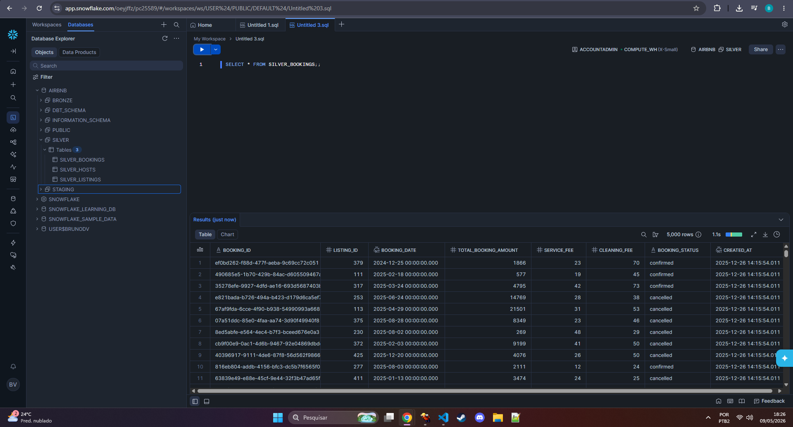 | 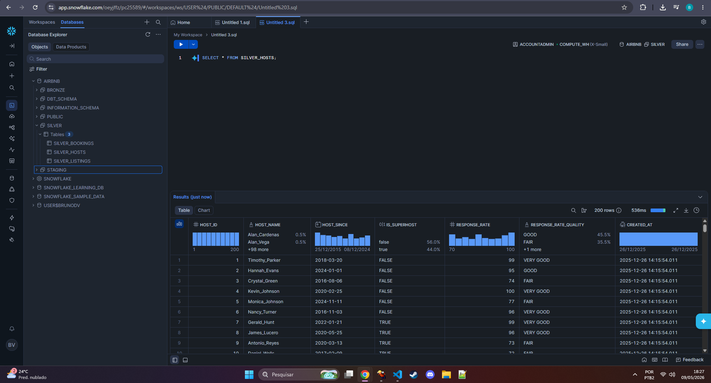 | 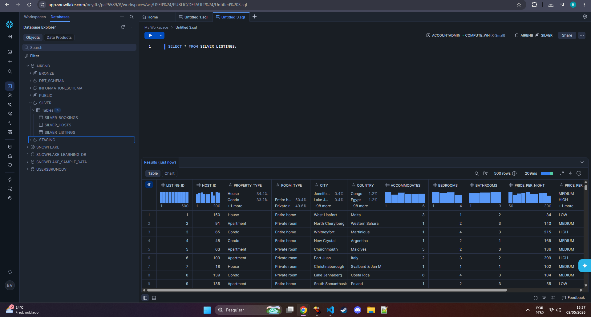 |

---

## Gold Layer — Analytics-Ready Models

The gold layer produces the final, business-ready tables consumed by BI tools and analysts. It uses Jinja **for-loop templating** to build dynamic multi-table JOIN queries from a configuration list, keeping the SQL DRY and maintainable.

### `fact.sql` — Main Fact Table

Joins all three silver tables into a single denormalised fact table. The loop iterates over a config list and emits the `FROM` clause and `LEFT JOIN`s dynamically:

```sql
{% set configs = [
    {
        "table"  : "AIRBNB.SILVER.SILVER_BOOKINGS",
        "columns": "SILVER_bookings.*",
        "alias"  : "SILVER_bookings"
    },
    {
        "table"          : "AIRBNB.SILVER.SILVER_LISTINGS",
        "columns"        : "SILVER_listings.HOST_ID, SILVER_listings.PROPERTY_TYPE, SILVER_listings.ROOM_TYPE,
                            SILVER_listings.CITY, SILVER_listings.COUNTRY, SILVER_listings.ACCOMMODATES,
                            SILVER_listings.BEDROOMS, SILVER_listings.BATHROOMS, SILVER_listings.PRICE_PER_NIGHT,
                            silver_listings.PRICE_PER_NIGHT_TAG, SILVER_listings.CREATED_AT AS LISTING_CREATED_AT",
        "alias"          : "SILVER_listings",
        "join_condition" : "SILVER_bookings.listing_id = SILVER_listings.listing_id"
    },
    {
        "table"          : "AIRBNB.SILVER.SILVER_HOSTS",
        "columns"        : "SILVER_hosts.HOST_NAME, SILVER_hosts.HOST_SINCE, SILVER_hosts.IS_SUPERHOST,
                            SILVER_hosts.RESPONSE_RATE, SILVER_hosts.RESPONSE_RATE_QUALITY,
                            SILVER_hosts.CREATED_AT AS HOST_CREATED_AT",
        "alias"          : "SILVER_hosts",
        "join_condition" : "SILVER_listings.host_id = SILVER_hosts.host_id"
    }
] %}

SELECT
    
        {{ config.columns }},
    
FROM
    
        
            {{ config.table }} AS {{ config.alias }}
        
            LEFT JOIN {{ config.table }} AS {{ config.alias }}
            ON {{ config.join_condition }}
        
    
```

**Output columns:** `BOOKING_ID`, `LISTING_ID`, `BOOKING_DATE`, `TOTAL_BOOKING_AMOUNT`, `SERVICE_FEE`, `CLEANING_FEE`, `BOOKING_STATUS`, `CREATED_AT`, `HOST_ID`, `PROPERTY_TYPE`, `ROOM_TYPE`, `CITY`, `COUNTRY`, `ACCOMMODATES`, `BEDROOMS`, `BATHROOMS`, `PRICE_PER_NIGHT`, `PRICE_PER_NIGHT_TAG`, `LISTING_CREATED_AT`, `HOST_NAME`, `HOST_SINCE`, `IS_SUPERHOST`, `RESPONSE_RATE`, `RESPONSE_RATE_QUALITY`, `HOST_CREATED_AT`

---

### `obt.sql` — One Big Table

Joins the OBT itself with the SCD2 dimension snapshots (`DIM_LISTINGS`, `DIM_HOSTS`) using the same loop pattern:

```sql
{% set configs = [
    {
        "table"  : "AIRBNB.GOLD.OBT",
        "columns": "GOLD_obt.BOOKING_ID, GOLD_obt.LISTING_ID, GOLD_obt.HOST_ID,
                    GOLD_obt.TOTAL_BOOKING_AMOUNT, GOLD_obt.SERVICE_FEE, GOLD_obt.CLEANING_FEE,
                    GOLD_obt.ACCOMMODATES, GOLD_obt.BEDROOMS, GOLD_obt.BATHROOMS,
                    GOLD_obt.PRICE_PER_NIGHT, GOLD_obt.RESPONSE_RATE",
        "alias"  : "GOLD_obt"
    },
    {
        "table"          : "AIRBNB.GOLD.DIM_LISTINGS",
        "columns"        : "",
        "alias"          : "DIM_listings",
        "join_condition" : "GOLD_obt.listing_id = DIM_listings.listing_id"
    },
    {
        "table"          : "AIRBNB.GOLD.DIM_HOSTS",
        "columns"        : "",
        "alias"          : "DIM_hosts",
        "join_condition" : "GOLD_obt.host_id = DIM_hosts.host_id"
    }
] %}

SELECT {{ configs[0]['columns'] }}
FROM
    
    
        {{ config['table'] }} AS {{ config['alias'] }}
    
        LEFT JOIN {{ config['table'] }} AS {{ config['alias'] }}
        ON {{ config['join_condition'] }}
    
    
```

---

### Ephemeral Models — Intermediate Dimension Slices

These models are **not materialised** in Snowflake. They exist only at query-time as CTEs, consumed by the snapshot definitions to create the SCD2 dimension tables.

**`gold_bookings.sql`** — selects `BOOKING_ID`, `BOOKING_DATE`, `BOOKING_STATUS`, `CREATED_AT` from `obt`

**`gold_listings.sql`** — selects `LISTING_ID`, `PROPERTY_TYPE`, `ROOM_TYPE`, `CITY`, `COUNTRY`, `PRICE_PER_NIGHT_TAG`, `LISTING_CREATED_AT` from `obt`

**`gold_hosts.sql`** — selects `HOST_ID`, `HOST_NAME`, `HOST_SINCE`, `IS_SUPERHOST`, `RESPONSE_RATE_QUALITY`, `HOST_CREATED_AT` from `obt`

```sql
-- Example: gold_hosts.sql
{{ config(materialized='ephemeral') }}

WITH gold_hosts AS (
    SELECT
        HOST_ID,
        HOST_NAME,
        HOST_SINCE,
        IS_SUPERHOST,
        RESPONSE_RATE_QUALITY,
        HOST_CREATED_AT
    FROM {{ ref('obt') }}
)
SELECT * FROM gold_hosts
```

---

## Snapshots — SCD Type 2 Dimension Tables

The three ephemeral gold models are fed into **dbt snapshots**, which implement **Slowly Changing Dimensions (Type 2)** using a timestamp strategy. Every time a record changes, dbt closes the old row (sets `DBT_VALID_TO`) and inserts a new one, preserving full history. Open-ended rows use `9999-12-31` as the sentinel date.

| Snapshot | Source Model | Unique Key | Timestamp Column |
|---|---|---|---|
| `dim_bookings` | `gold_bookings` | `BOOKING_ID` | `CREATED_AT` |
| `dim_listings` | `gold_listings` | `LISTING_ID` | `LISTING_CREATED_AT` |
| `dim_hosts` | `gold_hosts` | `HOST_ID` | `HOST_CREATED_AT` |

```yaml
# dim_hosts.yml
snapshots:
  - name: dim_hosts
    relation: ref('gold_hosts')
    config:
      schema: gold
      database: AIRBNB
      unique_key: HOST_ID
      strategy: timestamp
      updated_at: HOST_CREATED_AT
      dbt_valid_to_current: "to_date('9999-12-31')"
```

---

## Custom Macros

Reusable Jinja macros encapsulate domain-specific logic and keep models clean.

### `multiply(x, y, precision)`

Multiplies two columns and rounds to the given number of decimal places.

```sql

    round({{ x }} * {{ y }}, {{ precision }})

```

**Usage in `silver_bookings`:**
```sql
{{ multiply('NIGHTS_BOOKED', 'BOOKING_AMOUNT', 2) }} + CLEANING_FEE + SERVICE_FEE AS TOTAL_BOOKING_AMOUNT
```

---

### `tag(column_name)`

Classifies a numeric column into price tiers.

```sql

    CASE
        WHEN {{ column_name }} < 100 THEN 'LOW'
        WHEN {{ column_name }} < 200 THEN 'MEDIUM'
        ELSE 'HIGH'
    END

```

**Usage in `silver_listings`:**
```sql
{{ tag('CAST(PRICE_PER_NIGHT AS INT)') }} AS PRICE_PER_NIGHT_TAG
```

---

### `trimmer(column_name, node)`

Trims whitespace and converts a column name to uppercase.

```sql

    {{ column_name | trim | upper }}

```

---

### `generate_schema_name(custom_schema_name, node)`

Overrides dbt's default schema-name generation. If a `custom_schema_name` is provided (e.g. `gold`, `silver`), it uses that directly — without prepending the target schema. This keeps Snowflake schema names clean (`AIRBNB.GOLD.*` instead of `AIRBNB.AIRBNB_PROJECT_GOLD.*`).

```sql

    
    
        {{ default_schema }}
    
        {{ custom_schema_name | trim }}
    

```

---

## Data Quality Tests

### Custom Test — Negative Booking Amounts

A singular test that warns (does not fail) when `BOOKING_AMOUNT` is negative in the source staging table.

```sql
-- tests/source_tests.sql
{{ config(severity='warn') }}

SELECT 1
FROM   {{ source('staging', 'bookings') }}
WHERE  BOOKING_AMOUNT < 0
```

Run all tests with:
```bash
dbt test
```

---

## Data Flow Summary

```
AWS S3 (CSV)
    │
    │  COPY INTO (Snowflake Stage)
    ▼
AIRBNB.STAGING.*          ← raw tables (bookings, listings, hosts)
    │
    │  dbt run --select bronze.*
    ▼
AIRBNB.BRONZE.*           ← incremental append (CDC on CREATED_AT)
    │
    │  dbt run --select silver.*
    ▼
AIRBNB.SILVER.*           ← incremental upsert (unique_key merge)
    │
    │  dbt run --select gold.*
    ▼
AIRBNB.GOLD.FACT          ← denormalised fact table (all silver joins)
AIRBNB.GOLD.OBT           ← one big table (fact + dimension snapshots)
    │
    │  dbt snapshot
    ▼
AIRBNB.GOLD.DIM_BOOKINGS  ← SCD Type 2 history
AIRBNB.GOLD.DIM_LISTINGS  ← SCD Type 2 history
AIRBNB.GOLD.DIM_HOSTS     ← SCD Type 2 history
```

---

## Getting Started

### Prerequisites

- Python 3.11+
- [uv](https://github.com/astral-sh/uv) package manager
- Snowflake account with appropriate roles and warehouse

### Install dependencies

```bash
uv sync
```

### Configure Snowflake connection

Edit `~/.dbt/profiles.yml` (or the project profile) with your Snowflake credentials:

```yaml
AIRBNB_PROJECT:
  target: dev
  outputs:
    dev:
      type: snowflake
      account: <your-account>
      user: <your-user>
      password: <your-password>
      role: <your-role>
      database: AIRBNB
      warehouse: COMPUTE_WH
      schema: dev
```

### Run the pipeline

```bash
# Load staging data (run snowflake_sql scripts manually first)

# Run all dbt models
dbt run

# Run a specific layer
dbt run --select bronze.*
dbt run --select silver.*
dbt run --select gold.*

# Run snapshots (SCD2)
dbt snapshot

# Run tests
dbt test

# Generate and serve documentation
dbt docs generate
dbt docs serve
```
